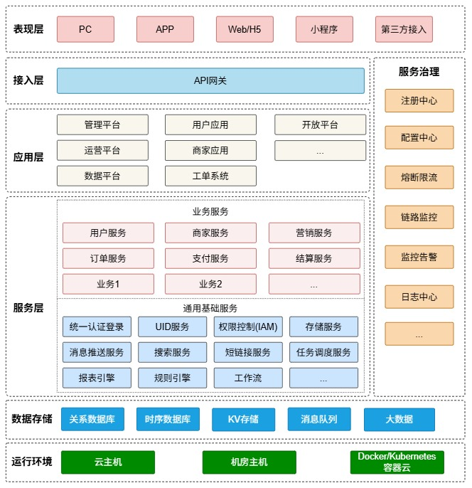

# micro-infra
一套可以复用的技术平台基础设施

## 1、简介
一个复杂的技术平台通常包含一些通用的功能，比如存储服务、权限管理、UID生成、网关、统一认证、消息推送、搜索服务、支付服务、订单服务、促销服务、任务调度、规则引擎、报表引擎、系统管理等，
它们可以被抽取出来，通过抽象设计，形成一套开箱即用、灵活扩展、易维护的快速开发框架，满足企业业务的快速迭代要求。

## 2、架构图

## 3、模块说明

### 3.1、account模块
用户账户管理，包括对用户基础信息、钱包、积分、卡券等信息进行管理

### 3.2、admin模块
系统管理，系统管理员用来对系统全局配置信息、运营商级别配置信息、用户权限等进行管理

### 3.3、业务模块biz-1
具体业务场景下的业务实现

### 3.4、业务模块biz-2
具体业务场景下的业务实现

### 3.5、cashier模块
收银台，用于用户扫码缴费

### 3.6、commons模块
系统公共功能组件

### 3.7、gateway模块
业务网关，鉴权、限流、路由、日志等

### 3.8、open-api模块
开放平台，用于对第三方平台API接入进行管理

### 3.9、operation模块
运营系统，根据具体的业务场景调用相应的业务模块

### 3.10、order模块
订单服务

### 3.11、parent模块
项目依赖版本和构建插件管理

### 3.12、passport模块
统一认证中心

### 3.13、payment模块
支付服务，适配各种支付通道，提供统一支付接口

### 3.14、promotion模块
促销服务，用于活动的定义、礼包的管理、适用规则等

### 3.15、push模块
消息推送服务，定义消息模版、适配消息通道、处理消息分发和接收

### 3.16、report模块
报表引擎，定义数据源、定义模版、报表设计

### 3.17、rulengine模块
规则引擎

### 3.18、scheduler模块
定时任务调度

### 3.19、search模块
搜索服务，基于Lucene的轻量级搜索引擎实现，及接入ES

### 3.20、shortlink模块
短链接生成服务

### 3.21、standalone模块
集成各功能模块的单体架构应用，适用于业务简单场景或运营商私有化部署场景

### 3.22、store模块
存储服务，适配云存储厂商服务、本地存储服务，提供统一存储接口

### 3.23、sysiam模块
权限管理，系统身份与访问管理

### 3.24、UID模块
UID服务，全局唯一ID生成与解析

### 3.25、workflow模块
工作流引擎，可视化流程设计和在线表单配置，流程定义、部署、执行等

### 3.26、workorder模块
客服工单系统

